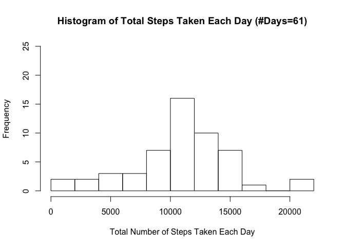
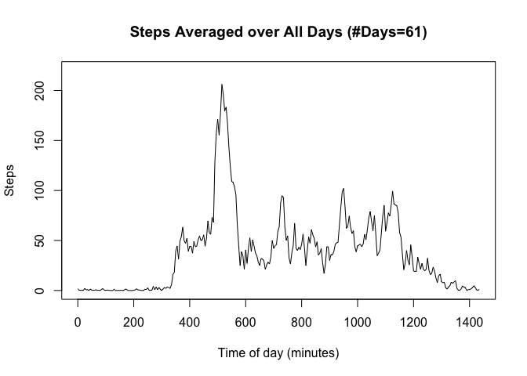
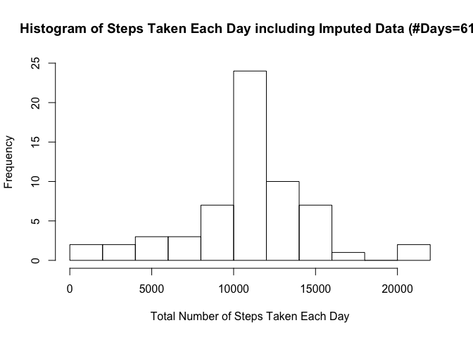
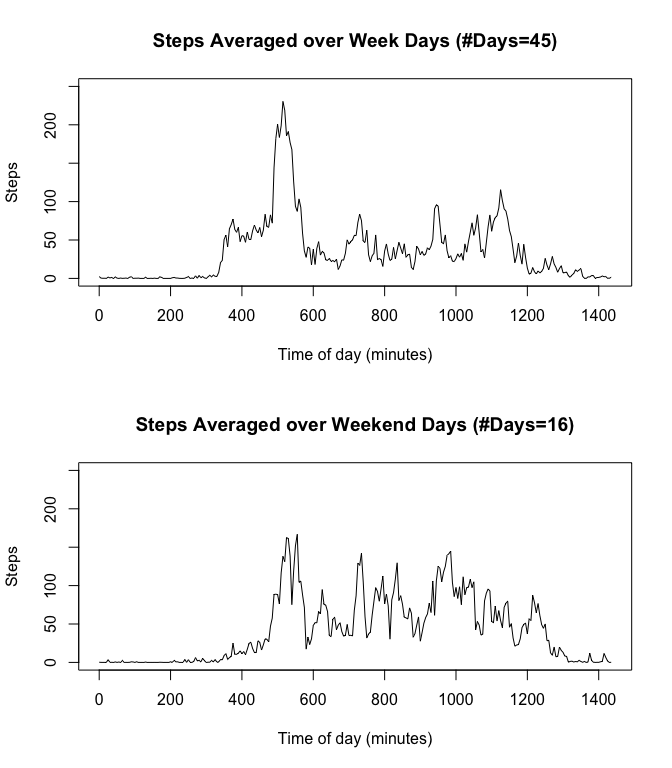

# Reproducible Research: Peer Assessment 1


## Loading and preprocessing the data

The variables included in this dataset are:

  -  steps: Number of steps taking in a 5-minute interval (missing values are coded as NA)
  -  date: The date on which the measurement was taken in YYYY-MM-DD format
  -  interval: Identifier for the 5-minute interval in which measurement was taken

The dataset is stored in a comma-separated-value (CSV) file and there are a total of 17,568 observations in this dataset.


```r
# Data Science Certificate - Reproducible Research
# Project 1
# Alec Dara-Abrams
# 2015-04-18
# V 1.0


# ======================================================================
## Loading and preprocessing the data

# Load the data set for this Project as a data frame with
# column names: steps, date, interval
activity_file <- "./github/RepData_PeerAssessment1/activity/activity.csv"
activity_df   <- read.csv( activity_file, header=TRUE )

# Ensure columns have these particular types
activity_df$steps     <- as.numeric( activity_df$steps ) 
activity_df$date      <- as.factor( activity_df$date ) 
activity_df$interval  <- as.factor( activity_df$interval ) 
```

## What is mean total number of steps taken per day?


```r
# ======================================================================
## What is mean total number of steps taken per day?

#> Compute the total number of steps taken on each day ($date)
#> (NAs are ignored for this computation.)
daily_steps <- by( activity_df$steps, activity_df$date, sum, simplify=FALSE )
# Coerce the list daily_steps into a numeric vector, daily_steps_num, for
# use below
daily_steps_num <- as.numeric( daily_steps )

# Compute the mean and the median of the total steps taken each day
num_days   <- length( daily_steps_num )
mean_dsn   <- mean(   daily_steps_num, na.rm=TRUE )
median_dsn <- median( daily_steps_num, na.rm=TRUE )


#> Plot a (first) histogram of the total steps taken on each day
main_title1 <- "Histogram of Total Steps Taken Each Day"
sub_title1  <- paste0( " (#Days=", num_days, ")" )
main_title1 <- paste0( main_title1, sub_title1 )
hist( daily_steps_num, 10,
      main=main_title1,
      xlab="Total Number of Steps Taken Each Day",
      ylim=c( 0, 25 ) # same limits as in second histogram below for comparison
    )
```

 


```
## The mean and median number of the total number of steps taken per day:
##  (Note, NAs are ignored for this computation.)
##     Mean:     10766.19
##     Median:   10765
##     Num Days: 61
## 
```


## What is the average daily activity pattern?


```r
# ======================================================================
## What is the average daily activity pattern?

#> Make a time series plot of the 5-minute interval (x-axis) and
#> the average number of steps taken, averaged across all days (y-axis)

interval_steps <- by( activity_df$steps, activity_df$interval,
                      mean, na.rm=TRUE, simplify=FALSE )
# Coerce the list returned by by() into a numeric vector
interval_steps_num <- as.numeric( interval_steps )

#> Plot the time series in interval_steps_num against the time (in minutes) of
#> the start of the corresponding interval.
time_of_day_in_minutes <- seq( from=0, to=( (24*60) - 5), by=5 )
main_title2 <- "Steps Averaged over All Days"
sub_title2  <- paste0( " (#Days=", num_days, ")" )
main_title2 <- paste0( main_title2, sub_title2 )
plot( time_of_day_in_minutes,
      interval_steps_num,
      type="l",
      main=main_title2,
      xlab="Time of day (minutes)",
      ylab="Steps",
      ylim=c( 0, 220)
    )
```

 

```r
# Get maximum step count for any interval in the average day
max_steps <- max(interval_steps_num)

# Which interval(s) hit this maximum step value?
# (In general, could be more than one such interval.)
hits_max <- ( interval_steps_num >= max_steps )

# index/indices of max
hits_max_interval <- which(hits_max)

# For simplicity, just take the first (earliest) interval if there are more
# than one intervals that hit max_steps.
the_max_interval <- hits_max_interval[1]

# Compute the start time, in time_of_max, (in 24-hour time) of the_max_interval
hits_max_time_of_day_mins  <- the_max_interval * 5
# Note odd operators: %/% is integer division and %% is modulo
hits_max_time_of_day_HH    <- hits_max_time_of_day_mins %/% 60
hits_max_time_of_day_MM    <- hits_max_time_of_day_mins %%  60
time_of_max <- paste0( hits_max_time_of_day_HH, ":", hits_max_time_of_day_MM )
```


```
## On average across all the days in the dataset the maximum number of
##  steps is contained in the 5-minute interval starting at 8:40 (24-hour time).
##  
##  The maximum number of steps in this 5-minute interval is: 206.17
## 
```


## Imputing missing values

We will modify the input data in data frame activity_df by replacing
any missing step value for, say, date=d and interval=intvl, with
the step value from the corresponding interval in the average daily
activity pattern (in numeric vector interval_steps_num).
We will produce a new, modified data frame, activity_WID_df .

Adding imputed date values *does* modify the histogram of total daily steps.
The peak value is higher but the overall distribution looks the same as
for the case without the imputed data.


```r
# ======================================================================
## Imputing missing values

# Get indices of NAs in activity steps column
NA_row_indices <- which( is.na( activity_df$steps ) )

total_num_rows_with_NA <- length( NA_row_indices )
```


```
## In the input data there are 2304 rows with a missing step value (indicated by NA).
```


```r
#> We will modify the input data in data frame activity_df by replacing
#> any missing step value for, say, date=d and interval=intvl, with
#> the step value from the corresponding interval in the average daily
#> activity pattern (in numeric vector interval_steps_num).
#> We will produce a new, modified data frame, activity_WID_df .
#> Note: WID is an abbreviation for "with imputed data included".
activity_WID_df <- activity_df
NAs_interval    <- as.factor(activity_WID_df[NA_row_indices, ]$interval)
imputed_vals    <- as.numeric(interval_steps_num[NAs_interval])
activity_WID_df[ NA_row_indices, "steps" ] <- imputed_vals

# Now that we have the new data frame activity_WID_df with imputed data
# replacing all the original NAs, we compute the mean, median and a histogram
# as we did for the original data above.

# Compute the total number of steps taken on each day ($date)
# (NAs have been replaced by imputed data for this computation.)
daily_steps_WID <- by( activity_WID_df$steps,
		       activity_WID_df$date,
		       sum, simplify=FALSE )
# Coerce the list from by() into a numeric vector
daily_steps_num_WID <- as.numeric( daily_steps_WID )

# Compute the mean and the median of the total steps taken each day
num_days_WID   <- length( daily_steps_num_WID )
mean_dsn_WID   <- mean(   daily_steps_num_WID, na.rm=TRUE )
median_dsn_WID <- median( daily_steps_num_WID, na.rm=TRUE )

#> Plot a (second) histogram of the total steps taken on each day
main_title3 <- "Histogram of Steps Taken Each Day including Imputed Data"
sub_title3  <- paste0( " (#Days=", num_days_WID, ")" )
main_title3 <- paste0( main_title3, sub_title3 )
hist( daily_steps_num_WID, 10,
      main=main_title3,
      xlab="Total Number of Steps Taken Each Day",
      ylim=c( 0, 25 ) # same limits as in first histogram above for comparison
    )
```

 

```r
#> Report the mean and the median of the total steps taken each day
```


```
## The mean and median number of the total number of steps taken per day:
##  (Note, NAs have been replaced with imputed data for this computation.)
##     Mean:     10766.19
##     Median:   10766.19
##     Num Days: 61
## 
```


## Are there differences in activity patterns between weekdays and weekends?

Weekday and week end activity *do* seem to differ.  Week day activity has most
of the steps concentrated during what may be a morning work out activity,
walk or run.  However, week end activity is much more spread out over the day.


```r
# ======================================================================
## Are there differences in activity patterns between weekdays and weekends?

# new column dayOfWeek will contain "Sunday", "Monday", ..., or "Saturday"
activity_WID_df$dayOfWeek <- weekdays( as.Date(activity_WID_df$date) )
# new column daytype will contain factor "Weekend" or "Weekday".
activity_WID_df$daytype   <- 
    factor( ifelse ( (activity_WID_df$dayOfWeek %in% c("Saturday","Sunday")),
                     "Weekend",
                     "Weekday"
                   ),
            levels=c( "Weekday", "Weekend" )
          )

# Compute Average Steps for Weekend and Weekday
interval_steps_daytype <- by( activity_WID_df$steps,
			      list( activity_WID_df$interval,
			            activity_WID_df$daytype
				  ),
			      mean, na.rm=TRUE, simplify=TRUE
                            )

# Total up # of the two types of days: Weekend and Weekday.
daytype_table   <- table( activity_WID_df$daytype )
# Note: 1 == factor value Weekday; 2 == factor value Weekend
num_weekdays    <- daytype_table["Weekday"] / length(interval_steps_daytype[,1])
num_weekenddays <- daytype_table["Weekend"] / length(interval_steps_daytype[,2])


#> Plot two panels in 2 rows of 1 column - Week Days above, Weekend Days below.
#
par( mfcol=c(2,1) )

# Remember: time_of_day_in_minutes <- seq( from=0, to=( (24*60) - 5), by=5 )
# Week day daily activity
main_title4 <- "Steps Averaged over Week Days"
sub_title4  <- paste0( " (#Days=", num_weekdays, ")" )
main_title4 <- paste0( main_title4, sub_title4 )
plot( time_of_day_in_minutes,
      as.numeric( interval_steps_daytype[,1] ),
      type="l",
      main=main_title4,
      xlab="Time of day (minutes)",
      ylab="Steps",
      ylim=c( 0, 250) # same limits as in time series plot below for comparison
    )

# Weekend day daily activity
main_title5 <- "Steps Averaged over Weekend Days"
sub_title5  <- paste0( " (#Days=", num_weekenddays, ")" )
main_title5 <- paste0( main_title5, sub_title5 )
plot( time_of_day_in_minutes,
      as.numeric( interval_steps_daytype[,2] ),
      type="l",
      main=main_title5,
      xlab="Time of day (minutes)",
      ylab="Steps",
      ylim=c( 0, 250) # same limits as in time series plot above for comparison
    )
```

 

```r
# ======================================================================
```

